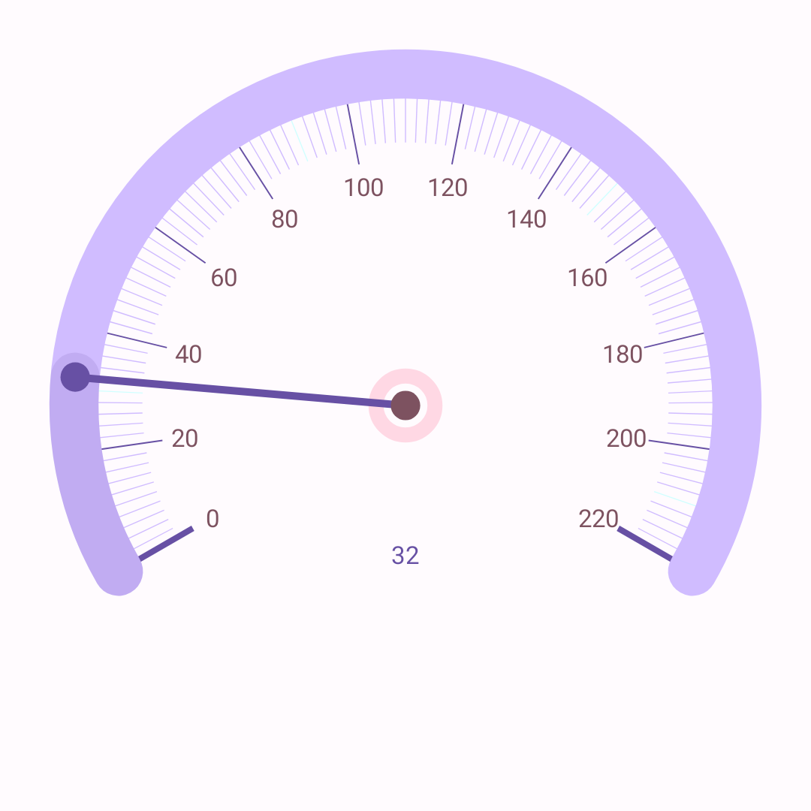
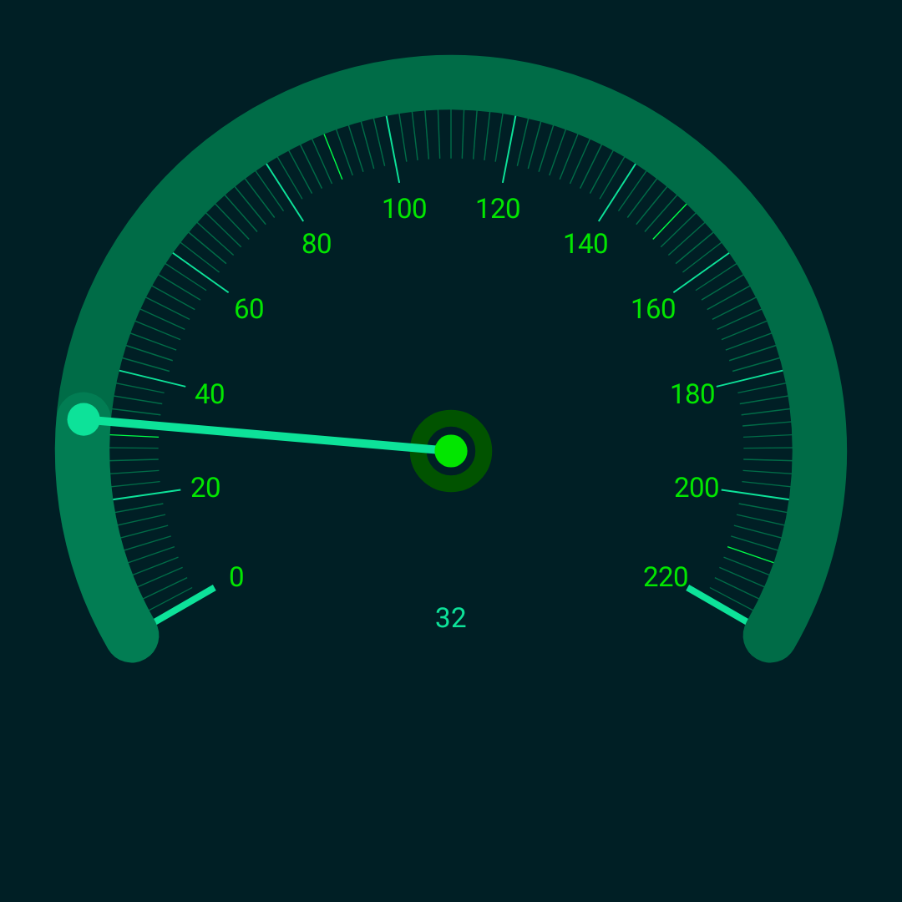
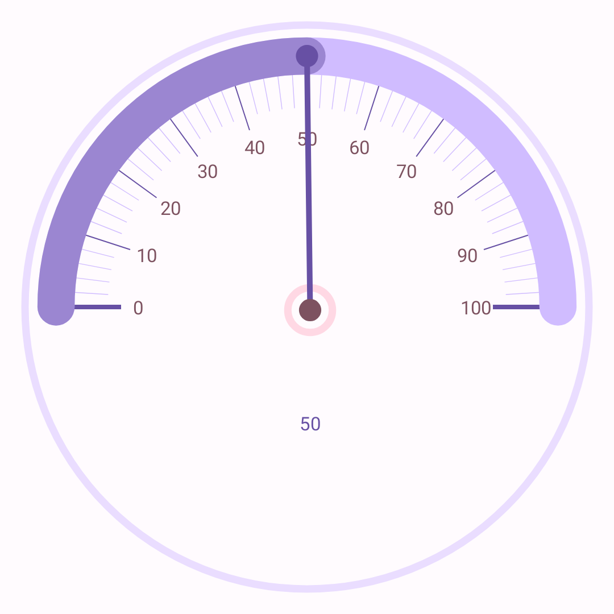
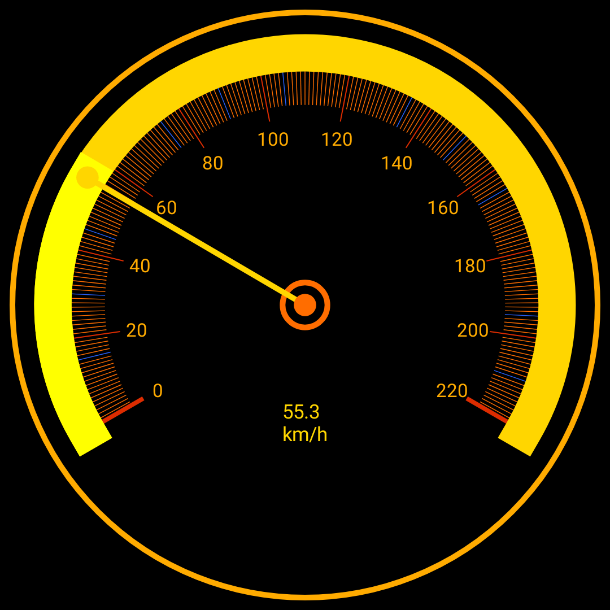

# Gauge

Gauge Composable is a fusion of classic and modern Gauges with some customization options.

## Preview

<table>
<tr>
<td>

</td>
<td>

</td>
</tr>
</table>

## Compatibility

**SDK24+** or **Android 7.0**+

## Usage

### Simple Usage



```kotlin
@Preview(showBackground = true)
@Composable
fun SimplePreview() {
    Surface {
        Gauge(
            modifier = Modifier.padding(16.dp),
            value = 50f,
            numerics = GaugeNumerics(
                startAngle = 180,
                sweepAngle = 180,
                valueRange = 0f..100f,
                smallTicksStep = 2,
                bigTicksStep = 10
            )
        )
    }
}
```

### Advanced Usage



```kotlin
@Preview(showBackground = true)
@Composable
fun AdvancedPreview() {
    Surface(
        color = Color.Black,
        content = {
            Gauge(
                modifier = Modifier.padding(8.dp),
                value = 55.35f,
                valueUnit = "km/h",
                decimalFormat = DecimalFormat().apply { maximumFractionDigits = 1 },
                totalSize = 500.dp,
                borderInset = 16.dp,
                numerics = GaugeNumerics(
                    startAngle = 150,
                    sweepAngle = 240,
                    valueRange = 0f..220f,
                    smallTicksStep = 1,
                    bigTicksStep = 20
                ),
                style = GaugeStyle(
                    hasBorder = true,
                    hasValueText = true,
                    borderWidth = 10f,
                    arcStyle = GaugeArcStyle(
                        hasArcs = true,
                        hasProgressiveAlpha = false,
                        bigTicksHasLabels = true,
                        cap = StrokeCap.Square
                    ),
                    needleStyle = GaugeNeedleStyle(
                        hasNeedle = true,
                        tipHasCircle = true,
                        hasRing = true,
                        ringWidth = 10f
                    )
                ),
                borderColor = Color(0xFFFFAB00),
                centerCircleColor = Color(0xFFFF6D00),
                valueColor = Color(0xFFFFD600),
                needleColors = GaugeNeedleColors(
                    needle = Color(0xFFFFD600),
                    ring = Color(0xFFFF6D00)
                ),
                arcColors = GaugeArcColors(
                    off = Color(0xFFFFD600),
                    on = Color(0xFF00C853)
                ),
                ticksColors = GaugeTicksColors(
                    smallTicks = Color(0xFFFF6D00),
                    bigTicks = Color(0xFFDD2C00),
                    bigTicksLabels = Color(0xFFFFAB00)
                ),
                arcColorsProvider = { colors, gaugeValue, range ->
                    when (gaugeValue) {
                        in range.start..range.endInclusive / 4 -> GaugeArcColors(
                            colors.off,
                            Color.Red
                        )

                        in range.endInclusive / 4..range.endInclusive / 2 -> GaugeArcColors(
                            colors.off,
                            Color.Yellow
                        )

                        in range.endInclusive / 2..range.endInclusive * 3 / 4 -> GaugeArcColors(
                            colors.off,
                            Color(0xFFFF8000)
                        )

                        else -> GaugeArcColors(colors.off, Color.Green)
                    }
                },
                ticksColorProvider = {
                    it.map { pair ->
                        if (pair.first % 15 == 0)
                            pair.first to Color(0xFF2962FF)
                        else pair
                    }
                }
            )
        }
    )
}
```

## Install

Check [latest](https://repo1.maven.org/maven2/com/github/yamin8000/gauge/Gauge/maven-metadata.xml)
version from Maven Repository
or [here](https://central.sonatype.com/artifact/com.github.yamin8000.gauge/Gauge).

### Gradle

#### Gradle Kotlin DSL

```kotlin
implementation("com.github.yamin8000.gauge:Gauge:version")
```

#### Gradle Groovy DSL

```groovy
implementation 'com.github.yamin8000.gauge:Gauge:version'
```

## Features

- Customization of most elements

## License

```
Gauge is free software: you can redistribute it and/or modify
it under the terms of the GNU General Public License as published by
the Free Software Foundation, either version 3 of the License, or
(at your option) any later version.

Gauge is distributed in the hope that it will be useful,
but WITHOUT ANY WARRANTY; without even the implied warranty of
MERCHANTABILITY or FITNESS FOR A PARTICULAR PURPOSE. See the
GNU General Public License for more details.

You should have received a copy of the GNU General Public License
along with Gauge. If not, see <https://www.gnu.org/licenses/>.
```
