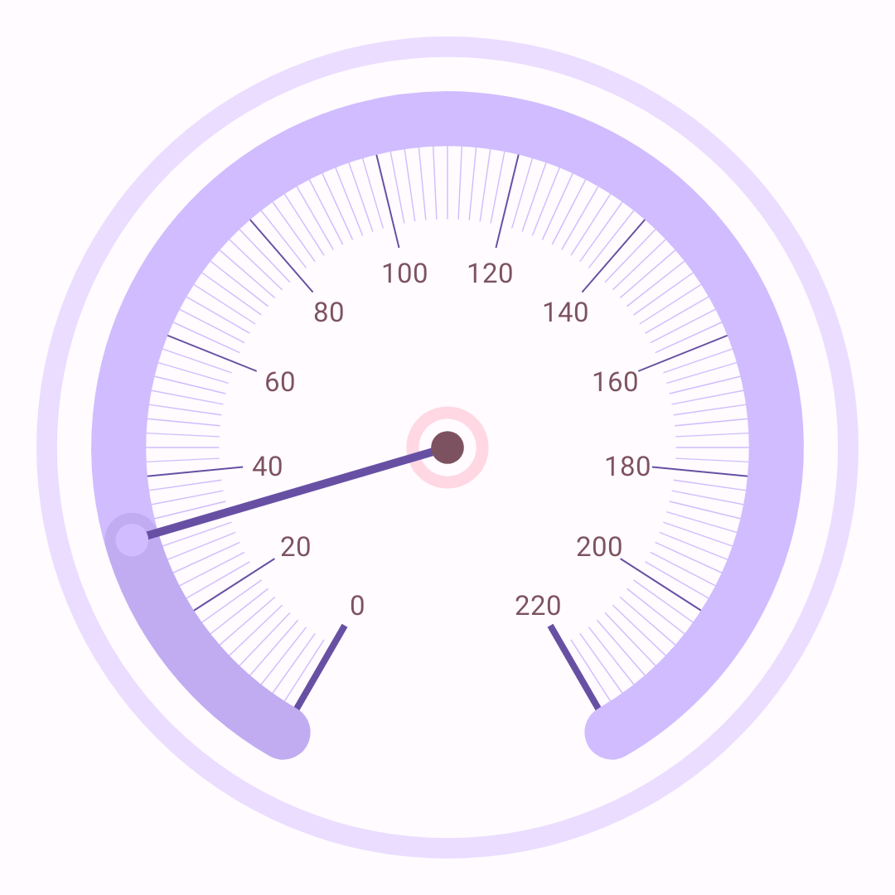
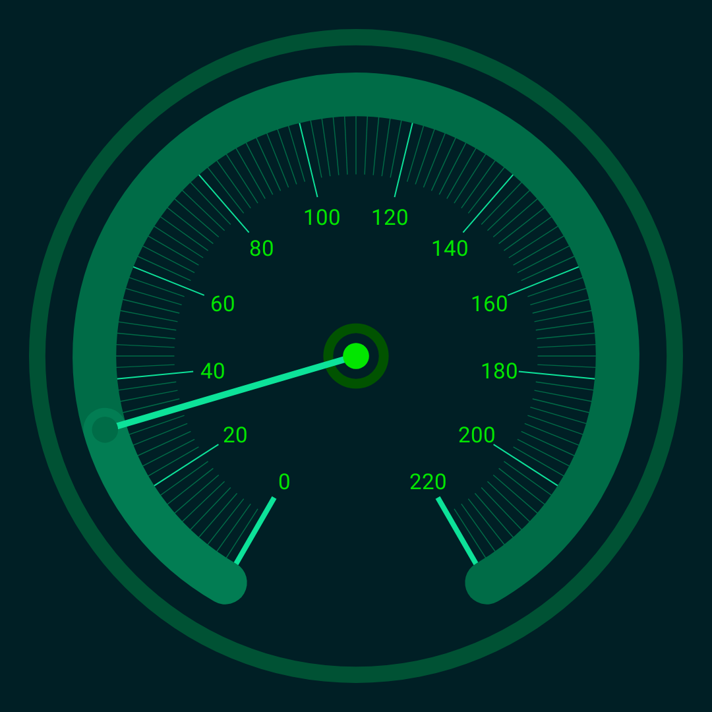

# Gauge (WIP)

Gauge Composable is a fusion of classic and modern Gauges with some customization options.

## Preview (WIP)




## Compatibility

**SDK24+** or **Android 7.0**+

## Usage

## Install

Check [latest](https://repo1.maven.org/maven2/com/github/yamin8000/gauge/Gauge/maven-metadata.xml)
version from Maven Repository
or [here](https://central.sonatype.com/artifact/com.github.yamin8000.gauge/Gauge).

### Gradle

#### Gradle Kotlin DSL

```kotlin
implementation("com.github.yamin8000.gauge:Gauge:version")
```

#### Gradle Groovy DSL

```groovy
implementation 'com.github.yamin8000.gauge:Gauge:version'
```

## Features

## License

```
Gauge is free software: you can redistribute it and/or modify
it under the terms of the GNU General Public License as published by
the Free Software Foundation, either version 3 of the License, or
(at your option) any later version.

Gauge is distributed in the hope that it will be useful,
but WITHOUT ANY WARRANTY; without even the implied warranty of
MERCHANTABILITY or FITNESS FOR A PARTICULAR PURPOSE. See the
GNU General Public License for more details.

You should have received a copy of the GNU General Public License
along with Gauge. If not, see <https://www.gnu.org/licenses/>.
```
